# Cisco-HSRP-Lab

## Overview
This project demonstrates the implementation of Hot Standby Router Protocol (HSRP) Version 2 on two Cisco Multilayer Switches.

The lab provides gateway redundancy for two VLANs while also implementing load balancing by assigning different active gateways for each VLAN.

## Objectives
- Configure HSRP Version 2
- Configure Virtual IP addresses
- Configure Priority
- Configure Preempt
- Configure HSRP Timers
- Implement Gateway Redundancy
- Implement Load Balancing between two multilayer switches
- Verify failover operation

## Network Topology 
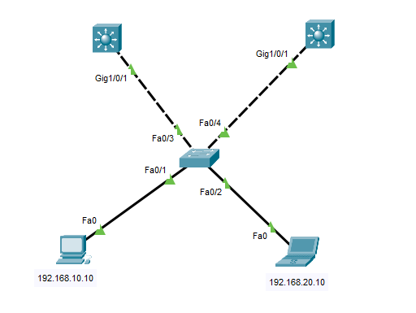

## IP Addressing
MLS1:

VLAN 10: 192.168.10.2/24

VLAN 20: 192.168.20.2/24

MLS2:

VLAN 10: 192.168.10.3/24

VLAN 20: 192.168.20.3/24

## Virtual Gateway
VLAN 10: 192.168.10.1

VLAN 20: 192.168.20.1 

## HSRP Design
### VLAN 10
Active Gateway: MLS1

Standby Gateway: MLS2

Virtual IP: 192.168.10.1

### VLAN 20
Active Gateway: MLS2

Standby Gateway: MLS1 

Virtual IP: 192.168.20.1

This design provides load balancing because each multilayer switch acts as the active gateway for one VLAN.

## HSRP Features
- HSRP Version 2
- Priority
- Preempt
- Hello Timer = 1 second
- Hold Timer = 3 seconds

## Verification 
### Vlan Configuration

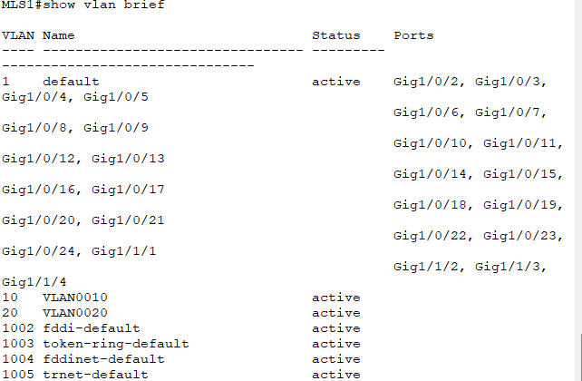

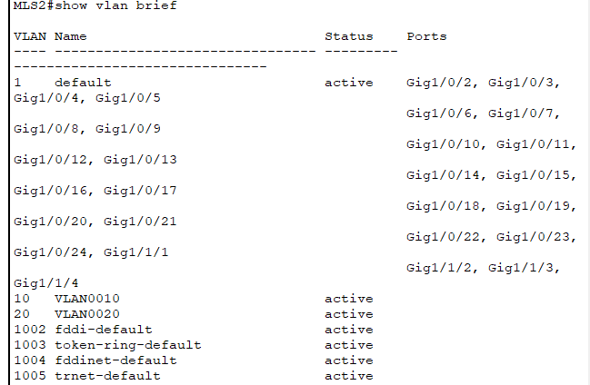

### Trunk Interfaces

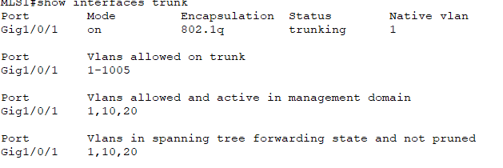

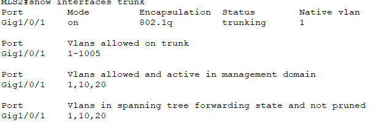

### Layer 3 Interfaces

### HSRP Status

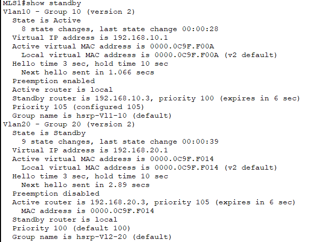

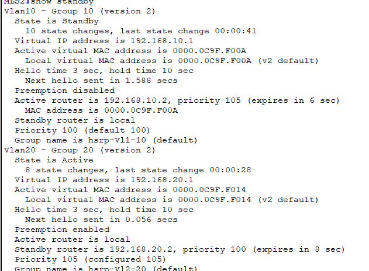

## Failover Test 
The following scenarios were tested:

- Shutdown active gateway interface
- Automatic election of standby device
- Gateway availability maintained
- End devices continued using the Virtual IP
- Successful failover without changing the default gateway

## Verification Results
### Before Failover 
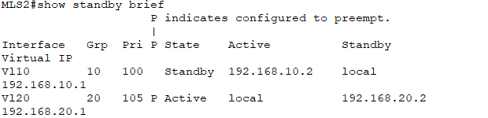

### After Failover
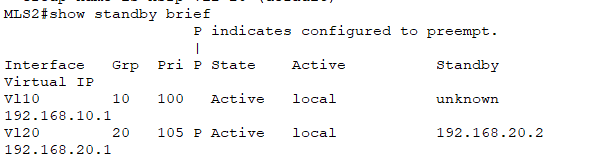

### After Preempt
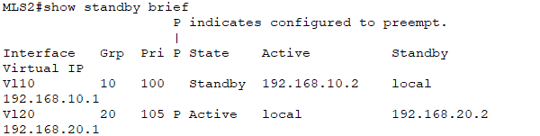

### Connectivity Tests
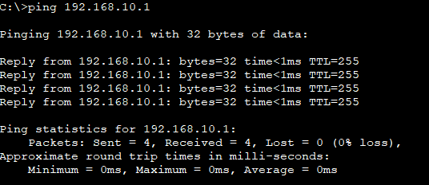
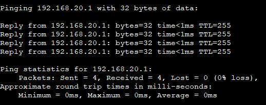
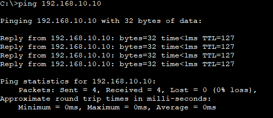

## Technologies Used

- Cisco Packet Tracer
- Cisco Multilayer Switch
- Cisco Catalyst 2960
- HSRP Version 2
- VLAN
- Trunking

